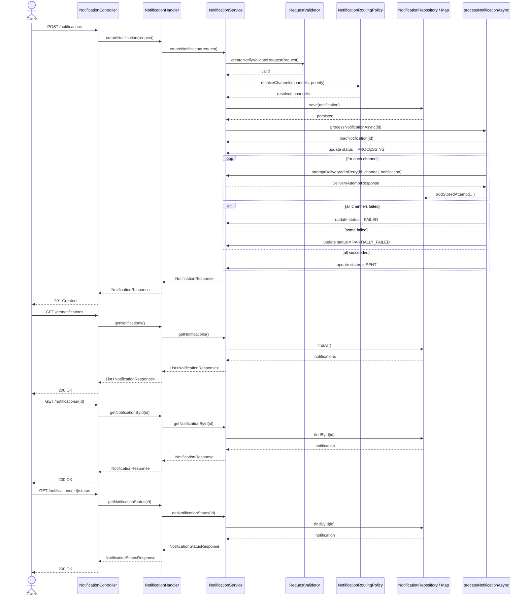

# Notification API Flow, Sequence Diagram, Postman Examples, and cURL Commands

Base URL:
- http://localhost:8080/api/v1

## 1) Sequence diagram



## 2) Postman examples

### Create notification

Request type: POST
URL: http://localhost:8080/api/v1/notifications
Headers:
- Content-Type: application/json

Body:
```json
{
  "notificationId": "notif-1001",
  "sourceSystem": "billing-system",
  "correlationId": "corr-1001",
  "notificationType": "ALERT",
  "severity": "ERROR",
  "priority": "HIGH",
  "recipients": [
    "ops@example.com",
    "+15551234567"
  ],
  "channels": ["EMAIL", "SMS"],
  "createdAt": "2026-09-12T17:40:00",
  "scheduledAt": null,
  "expiresAt": null,
  "title": "Payment due",
  "message": "Invoice 1024 is due today"
}
```

Example success response:
```json
{
  "id": "notif-1001",
  "notificationId": "notif-1001",
  "sourceSystem": "billing-system",
  "correlationId": "corr-1001",
  "notificationType": "ALERT",
  "severity": "ERROR",
  "priority": "HIGH",
  "recipients": [
    "ops@example.com",
    "+15551234567"
  ],
  "channels": ["EMAIL", "SMS"],
  "createdAt": "2026-09-12T17:40:00",
  "scheduledAt": null,
  "expiresAt": null,
  "title": "Payment due",
  "message": "Invoice 1024 is due today",
  "status": "QUEUED",
  "deliveryAttempts": []
}
```

### Get all notifications

Request type: GET
URL: http://localhost:8080/api/v1/getnotifications

### Get notification by ID

Request type: GET
URL: http://localhost:8080/api/v1/notifications/notif-1001

### Get notification status by ID

Request type: GET
URL: http://localhost:8080/api/v1/notifications/notif-1001/status

Example status response:
```json
{
  "id": "notif-1001",
  "notificationId": "notif-1001",
  "overallStatus": "PROCESSING",
  "selectedChannels": ["EMAIL", "SMS"],
  "recipientDeliveryStatus": [
    {
      "recipient": "ops@example.com",
      "channel": "EMAIL",
      "status": "QUEUED"
    },
    {
      "recipient": "+15551234567",
      "channel": "SMS",
      "status": "QUEUED"
    }
  ],
  "createdAt": "2026-09-12T17:40:00",
  "scheduledAt": null,
  "expiresAt": null,
  "lastUpdatedAt": "2026-09-12T17:40:05"
}
```

### Postman collection structure

If you want to import this in Postman manually, add these requests:

- Create Notification
- Get All Notifications
- Get Notification By ID
- Get Notification Status

Each request should use the base URL variable:
```text
{{baseUrl}} = http://localhost:8080/api/v1
```

## 3) cURL commands

### Create notification
```bash
curl -X POST "http://localhost:8080/api/v1/notifications" \
  -H "Content-Type: application/json" \
  -d '{
    "notificationId": "notif-1001",
    "sourceSystem": "billing-system",
    "correlationId": "corr-1001",
    "notificationType": "ALERT",
    "severity": "ERROR",
    "priority": "HIGH",
    "recipients": ["ops@example.com", "+15551234567"],
    "channels": ["EMAIL", "SMS"],
    "createdAt": "2026-09-12T17:40:00",
    "scheduledAt": null,
    "expiresAt": null,
    "title": "Payment due",
    "message": "Invoice 1024 is due today"
  }'
```

### Get all notifications
```bash
curl -X GET "http://localhost:8080/api/v1/getnotifications"
```

### Get notification by ID
```bash
curl -X GET "http://localhost:8080/api/v1/notifications/notif-1001"
```

### Get notification status by ID
```bash
curl -X GET "http://localhost:8080/api/v1/notifications/notif-1001/status"
```

### Example invalid request
```bash
curl -X POST "http://localhost:8080/api/v1/notifications" \
  -H "Content-Type: application/json" \
  -d '{
    "notificationId": "notif-invalid",
    "sourceSystem": "",
    "correlationId": "corr-1002",
    "notificationType": "ALERT",
    "severity": "ERROR",
    "priority": "HIGH",
    "recipients": ["ops@example.com"],
    "channels": ["EMAIL"],
    "createdAt": "2026-09-12T17:40:00",
    "title": "Bad request",
    "message": "Source system is missing"
  }'
```

## Notes

- The app uses async delivery processing after a notification is created.
- A notification may move through states such as `QUEUED -> PROCESSING -> SENT`, `PARTIALLY_FAILED`, or `FAILED`.
- Retry behavior is applied only to retryable downstream failure types.
- The status endpoint is useful to poll the current result of the async processing.
